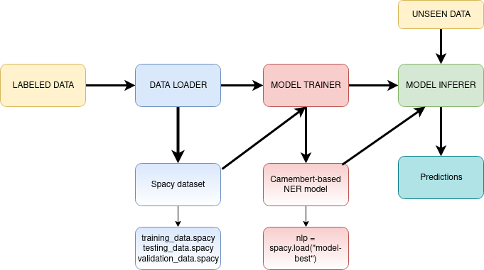

# Train Custom Spacy NER (token-classifier) models

The main goal of this repository is to make easy the training of custom NER model.

**Author:** Anonymized for Journal review
**Contact:** psycholinquistic2125@gmail.com



# Table of content

- [0. About](#0-about)
- [1. Installation](#1-installation)
- [2. Usage](#2-usage)


## 0. About
The main goal of this repository is to make easy the training of custom NER model. Before using it, you need to have label data in *.jsonl* format. You can use Doccano (https://doccano.github.io/doccano/) for instance to label your data. The code is constructed in a way, you only need to update the config file *config.yaml* and launch *main.py* to train and evaluate a spacy model. The cleaning and data preprocessing are taking care of. 
Customs NER models can be very useful in social science or in linguistic. in our case, we use it for 4 purposes :
- detect different value of pronoun ("on" in french)
- detect different value of present time (historical present, generic present, enunciation present)
- detect the lexical field associated to death (explicit and implicit mentions)
- detect the lexical field associated with the body, sensation and perception

## 1. Installation
To make it work: (works on 3.9 also)
- Create a virtual environment (python3.8 -m venv /path/to/env)
- Activate the environment (source /path/to/env/bin/activate)
- Clone the directory (git clone )
- Install dependencies (pip install -r requirements.txt)
- Change the config file (*config.yaml*) according to the data file
- Launch the training: *python3.8 main.py*

## 2. Usage

### 2.1. Config file
The config file is a yaml file. It contains all the information needed to train a spacy model. The config file is divided in 2 parts:
1)  data: contains the path to the data file and the path to the output directory
For each ner model you want to train, you need to add a section to the data part. For instance, if you want to train a model to detect the lexical field associated with death, you need to add the following section:
```
data_death :
    origin_file : "death.jsonl"
    validation_file : ""
    labels:  ['DEATH_IMPLICITE', 'DEATH_EXPLICITE']
    dataset_folder : "./data/data_death"
```


2)  training: contains the parameters for the training, the path to the config folder and a section for each specific model you want to train. For instance, if you want to train a model to detect the lexical field associated with death, you need to add the following section:
```
  model_death:
    gpu : 0
    config_name : "death_config_transformers.cfg"
    model_folder : "./models/model_death"
    performance_filename : "performances_death.json"
```

## 2.2 data file

The data file need to be on .jsonl format (one line = one document). This repository is particularly adapted for long document. We only tested with Doccana files.


## 2.3 the training config file

There are located in ./training_config. We suggest to use one config file for each model you want to create.
This  config_file is taken from spacy-transformers. You can find more information here: https://spacy.io/usage/training#config

## 2.4 resuls

The trained model is located in ./models with its associated performances.
using the script: "main_push_model_huggingface.py" ; you can push the model to ypur hugging face space. You need to have a hugging face account and to have installed the hugging face library (pip install spacy_huggingface_hub).


 
